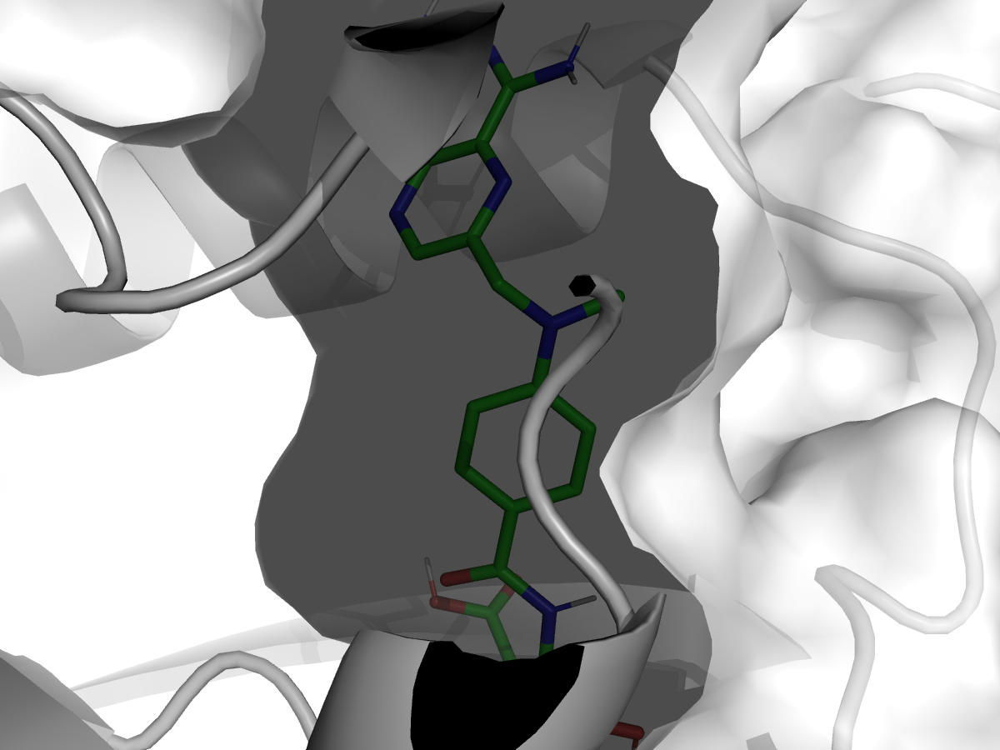

# AI-Powered Protein Docking: Targeting Human DHFR

## Project Overview
This project presents a complete computational drug discovery workflow, from a protein's genetic sequence to predicting its interaction with small molecules. We targeted **human Dihydrofolate Reductase (DHFR)**, a crucial enzyme and a well-established target for cancer drugs.

Starting with the amino acid sequence of DHFR (UniProt ID: **P00374**), we first predicted its complex 3D structure using **ColabFold (AlphaFold2)**. Following this, we performed molecular docking simulations with **AutoDock Vina** to analyze how DHFR interacts with its natural substrate, **Folate**, and two known inhibitor drugs, **Methotrexate** and **Trimethoprim**.

This repository serves as a showcase of modern bioinformatics skills, integrating AI-based structure prediction with classical molecular docking techniques.

---

## Key Tools Used
* **Structure Prediction:** ColabFold (AlphaFold2)
* **Molecular Docking:** AutoDock Vina
* **Molecular Visualization:** PyMOL
* **File Format Conversion:** Open Babel, MGLTools
* **Environment Management:** Conda
* **Data Sources:** UniProt (Protein Sequence), PubChem (Ligand Structures)

---

## Workflow Diagram
**Sequence → 3D Structure → Preparation → Docking → Analysis**

1.  **Protein Sequence Acquisition:** The canonical amino acid sequence for human DHFR (P00374) was downloaded from the UniProt database.
2.  **AI-Based Structure Prediction:** The FASTA sequence was used as input for ColabFold to generate a high-quality 3D protein model (`.pdb` file).
3.  **Receptor Preparation:** The predicted PDB structure was cleaned using PyMOL (removing heteroatoms, adding hydrogens) and then converted to the required `.pdbqt` format using MGLTools.
4.  **Ligand Preparation:** 3D structures for Methotrexate, Trimethoprim, and Folate were downloaded from PubChem as `.sdf` files. Open Babel was used to convert these to the final `.pdbqt` format.
5.  **Docking Simulation:** AutoDock Vina was run for each ligand against the prepared DHFR receptor. A search box was defined around the known active site of the enzyme.
6.  **Results Analysis & Visualization:** The binding affinities from the Vina log files were parsed into a summary table. The top-ranked binding pose for each ligand was saved as a high-resolution image using PyMOL.

---

## Results & Discussion
The docking simulations yielded the binding affinities (measured in kcal/mol), where a more negative value suggests a stronger, more favorable interaction.

| Ligand         | PubChem CID | Binding Affinity (kcal/mol) | Role                |
|----------------|-------------|-----------------------------|---------------------|
| Folate         | 6037        | -9.07                       | Natural Substrate   |
| Methotrexate   | 126941      | -8.894                      | Chemotherapy Drug   |
| Trimethoprim   | 5578        | -7.152                      | Antibiotic          |

The results align well with known biological data. The natural substrate, **Folate**, shows the strongest binding affinity, as expected. The potent chemotherapy drug, **Methotrexate**, which is designed to mimic Folate and block the active site, shows a very similar and strong binding energy. **Trimethoprim**, an antibiotic designed to target bacterial DHFR, shows significantly weaker binding to human DHFR, which is consistent with its clinical use and lower side-effect profile in humans.

### Visualizing the Best Pose: Methotrexate
The image below shows the predicted binding mode of Methotrexate within the active site of DHFR. This visual analysis is crucial for understanding the specific molecular interactions (like hydrogen bonds) that stabilize the drug-protein complex.



---

## How to Reproduce This Project
1.  **Clone the Repository:**
    ```bash
    git clone [https://github.com/your-username/your-repository-name.git](https://github.com/your-username/your-repository-name.git)
    cd your-repository-name
    ```
2.  **Create Conda Environment:** All dependencies are listed in the `env.yml` file.
    ```bash
    conda env create -f env.yml
    conda activate docking-env
    ```
3.  **Install Manual Dependencies:** Ensure AutoDock Vina and MGLTools are installed and accessible in your system's PATH.
4.  **Run Workflow:** Follow the steps outlined in the original project guide, which involve running the scripts for structure preparation, ligand preparation, and docking.

---

## License
This project is licensed under the MIT License. See the `LICENSE` file for details.
